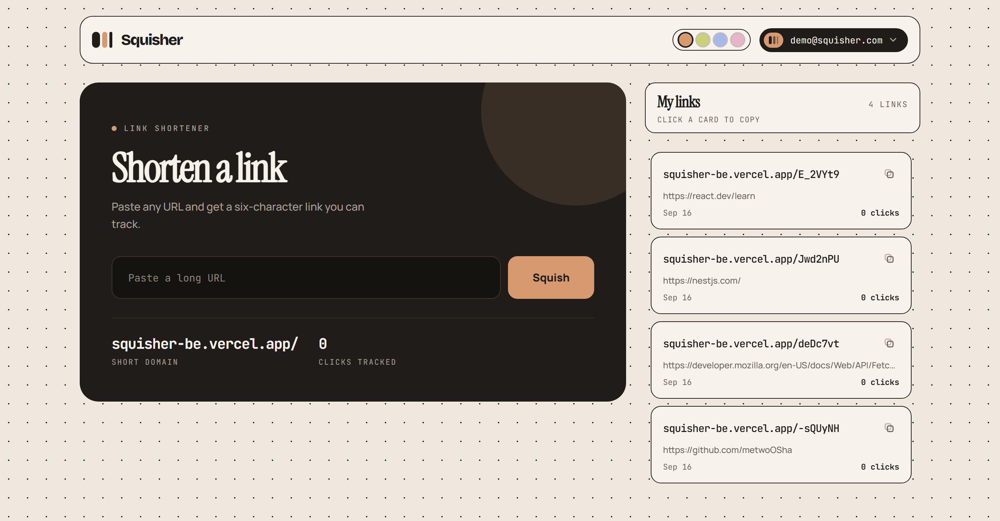
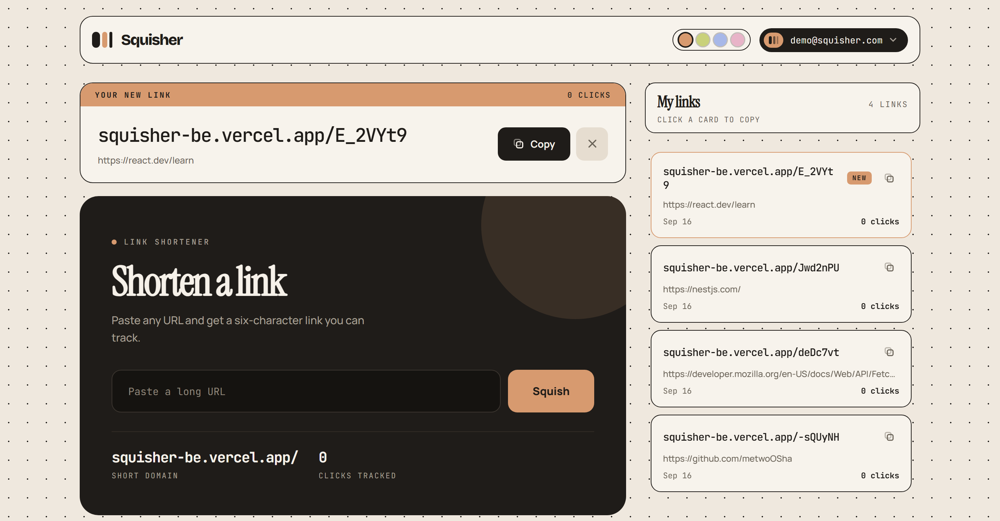
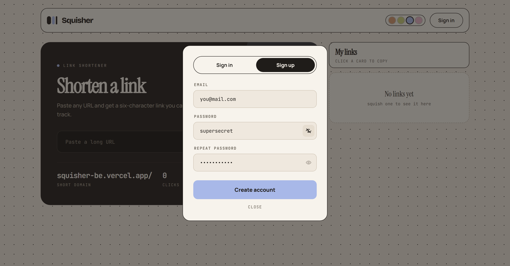
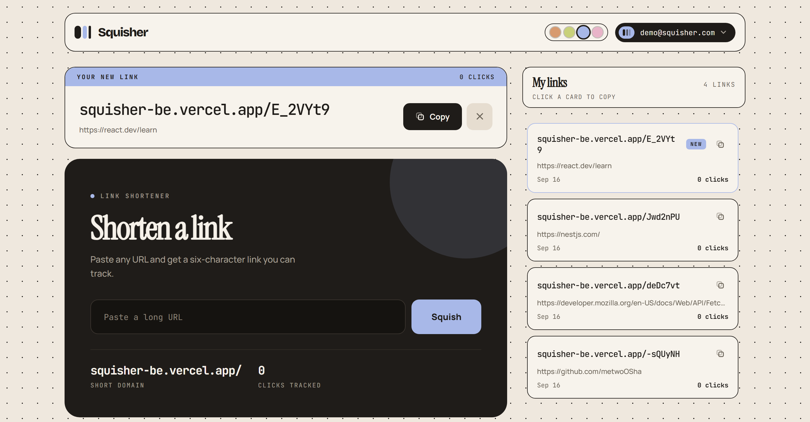

# Squisher

Link shortener with click tracking — shorten a URL as a guest, sign in later and keep the links you already made.


**[Live demo](https://squisher-kappa.vercel.app/)** · **[Backend repo](https://github.com/metwoOSha/Squisher_BE)**

## Test account

```
Email: demo@squisher.com
Password: Demo1234
```

## Screenshots

<p float="left">
  
  
</p>

<p float="left">
  
  
</p>

## Highlights

- **Anonymous-first, account optional.** Nothing gates the shortener: a first-time visitor squishes a URL and the backend issues an `anonId` cookie that owns the link. Signing in swaps ownership to the account — `App.tsx` keeps the last user id in a ref and refetches only when it actually changes, so the panel reloads on sign-in/sign-out but not on every auth render.
- **Auth is a cookie question, never a token one.** [`http.ts`](src/api/http.ts) sends every request with `credentials: 'include'` and no `Authorization` header; there is no token in `localStorage`, no JWT parsing, no `document.cookie` anywhere in `src/`. [`AuthProvider`](src/components/AuthProvider/AuthProvider.tsx) decides who you are purely from whether `GET /auth/me` succeeds — a 401 is the normal "guest" answer and is caught, not surfaced.
- **Loading states hold their own space.** [`CardSkeleton`](src/components/CardSkeleton/CardSkeleton.tsx) mirrors the real card's box so the list doesn't jump when data lands, and the header's account slot renders a placeholder of the same footprint while `/auth/me` is in flight, with `.actions` pinned to the tallest of the three states — the header height stays identical whether you are loading, a guest, or signed in.
- **One click count, fetched once.** `GET /links` returns each link's click total, so the list is a single request. An earlier version asked `/links/:code/stats` per link, which overran the API's rate limit on any real list and quietly rendered zeroes.
- **Design tokens lifted straight from the design file.** Every colour, radius, easing and keyframe lives as a CSS custom property in [`globals.css`](src/styles/globals.css); components compose those variables and never hardcode a value. The accent is a runtime variable (`--accent`) driven by the header swatches and persisted to `localStorage`, so the whole palette re-tints without a re-render.
- **Edge fades measured, not faked.** [`useScrollMask`](src/hooks/useScrollMask.ts) builds a `linear-gradient` mask from the container's scroll position and only fades the edge that still has content behind it, re-measuring on scroll, resize and list changes.
- **The modal backdrop is deliberately inert.** It holds a form, so a stray click outside no longer discards what was typed — Escape and the close button are the ways out.

## Stack

- **Framework:** React 19, TypeScript 6, Vite 8
- **Styling:** CSS Modules over design tokens — no UI or CSS framework
- **State:** React only (Context for auth, hooks per concern) — no state library
- **Dependencies:** `clsx` is the single runtime dependency besides React
- **Tooling:** oxlint, `tsc -b`

## Project structure

```
src/
├── api/            # http.ts fetch wrappers + one module per resource; ApiError carries the status code
├── components/     # one folder per component: Component.tsx + Component.module.css
│   ├── AuthModal/, AuthProvider/, ModalOverlay/, PasswordField/   # auth
│   ├── MainSquisherBlock/, ResultCard/, SquishButton/             # shortening
│   ├── LinksPanel/, Card/, CardSkeleton/, EmptyState/             # the links list
│   └── Header/, Logo/, UserMenu/, AccentPicker/, Toast/, Icons/   # chrome
├── config/         # API origin, accent swatches, shared constants
├── helpers/        # pure formatting and validation (normalizeUrl, formatDate, pluralize)
├── hooks/          # useAuth, useLinks, useAccent, useCopy, useScrollMask, useEscapeKey, useLockBodyScroll
├── styles/         # globals.css holds every token and keyframe; mixins.module.css holds shared surfaces
├── types/          # shared interfaces
└── utils/Portal.tsx
```

## Prerequisites & running locally

- Node.js 20+
- The [backend](https://github.com/metwoOSha/Squisher_BE) running, or reachable — this app has no API of its own

```bash
npm install
cp .env.example .env
# point VITE_API_URL at your backend, e.g. http://localhost:3000
npm run dev
```

Open [http://localhost:5173](http://localhost:5173).

Requests go straight to `VITE_API_URL` and the backend answers them with CORS, so its `CORS_ORIGINS` has to include `http://localhost:5173`.

**Environment variables** (`.env`):

| Variable | Description |
|---|---|
| `VITE_API_URL` | Backend origin, no trailing slash. Defaults to `http://localhost:3000` |
| `VITE_SHORT_LINK_ORIGIN` | Optional. Origin the short links point at; defaults to `VITE_API_URL`, which is what serves the redirect |

## Lint & testing

```bash
npm run lint      # oxlint
npm run build     # tsc -b && vite build
npm run preview   # serve the production build
```

There is no automated test suite yet; `lint` and the type-check inside `build` are what gate a change.
